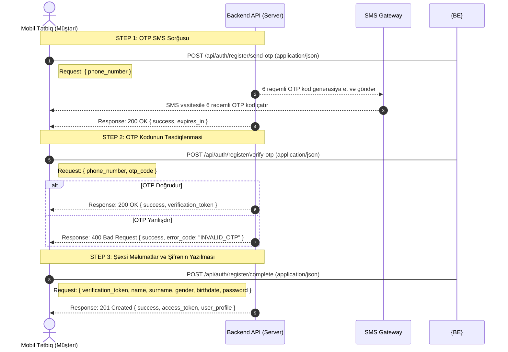
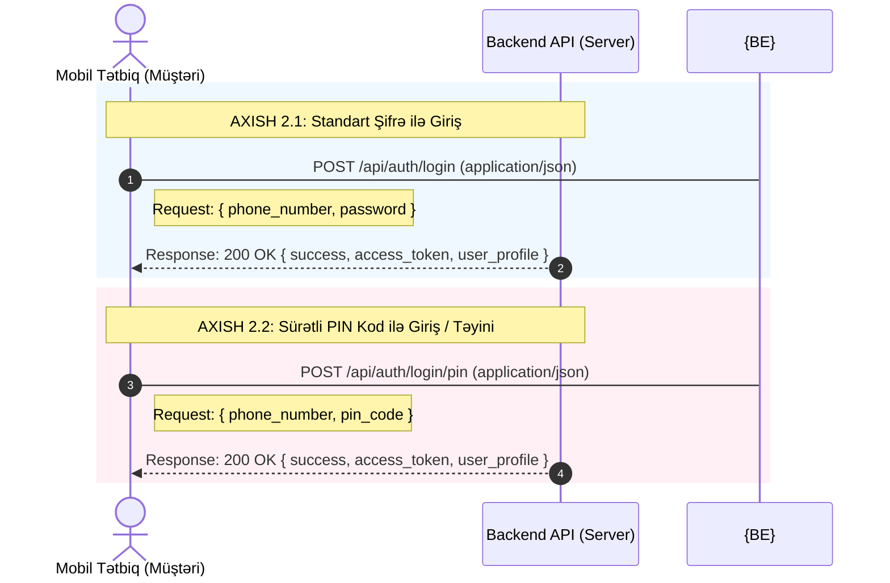
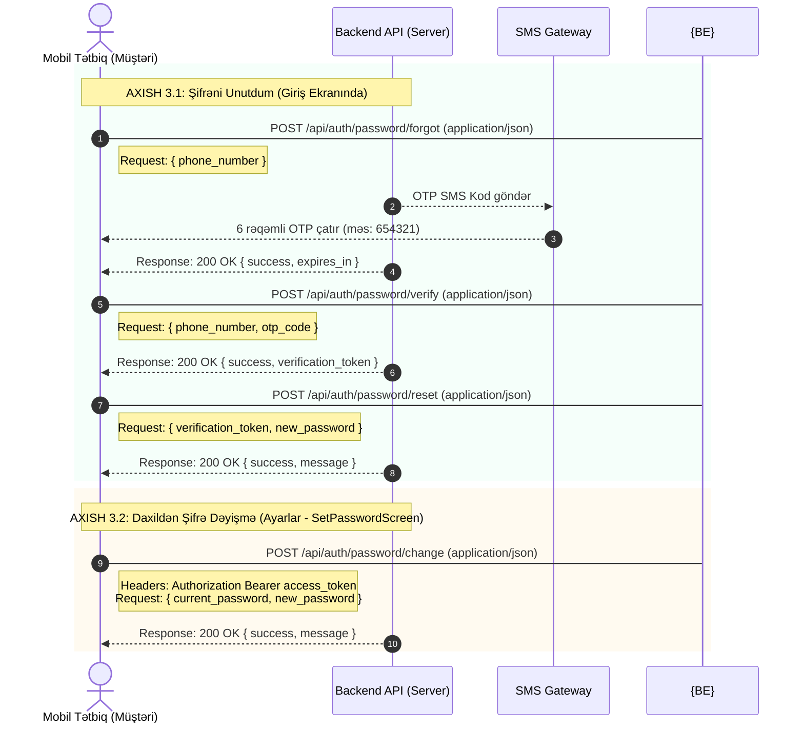

# 🚀 Loya Mobil Tətbiqi — Müştəri Auth (Qeydiyyat, Giriş & Şifrə) API Spesifikasiyası

Bu sənəd **Loya** mobil tətbiqində **standart istifadəçinin (müştərinin)** qeydiyyat, giriş, PIN kod təyini, şifrə sıfırlama (unutdum) və tətbiq daxilindən cari şifrəni dəyişmə (change password) axışlarını və müvafiq **Sorğu (Request) JSON** modellərini tam və aydın şəkildə əhatə edir.

---

## 🔄 BÖLMƏ 1: ARDICILLIQ DİAQRAMLARI (SEQUENCE FLOWS)

### AXISH 1: Yeni İstifadəçi Qeydiyyatı (Registration)


### AXISH 2: Giriş (Login) & PIN Girişi


### AXISH 3: Şifrənin İdarə Edilməsi (Unutdum & Sıfırlama)


---

## 📝 BÖLMƏ 2: API REQUEST JSON MODELLƏRİ & ENDPOINTS

Bütün sorğuların (Requests) göndərilmə formatı `Content-Type: application/json` olmalıdır.

### 1. 📝 QEYDİYYAT (REGISTER) SORĞULARI

#### A. OTP SMS Sorğusu (Mərhələ 1)
* **Endpoint:** `POST /api/auth/register/send-otp`
```json
{
  "phone_number": "+994519876543"
}
```

#### B. OTP Doğrulanması (Mərhələ 2)
* **Endpoint:** `POST /api/auth/register/verify-otp`
```json
{
  "phone_number": "+994519876543",
  "otp_code": "654321"
}
```

#### C. Qeydiyyatın Tamamlanması (Mərhələ 3)
* **Endpoint:** `POST /api/auth/register/complete`
```json
{
  "verification_token": "eyJhbGciOiJIUzI1NiIsInR5cCI6IkpXVCJ9.eyJwaG9uZV9udW1iZXIiOiIrOTk0NTE5ODc2NTQzIn0...",
  "name": "Ali",
  "surname": "Aliyev",
  "gender": "male",
  "birthdate": "1998-05-18",
  "password": "Password123!"
}
```

---

### 2. 🔑 GİRİŞ (LOGIN) SORĞULARI

#### A. Standart Şifrə ilə Giriş (Password Login)
* **Endpoint:** `POST /api/auth/login`
```json
{
  "phone_number": "+994519876543",
  "password": "Password123!"
}
```

#### B. Sürətli PIN Kod ilə Giriş (PIN Login / PIN Setup)
* **Endpoint:** `POST /api/auth/login/pin`
```json
{
  "phone_number": "+994519876543",
  "pin_code": "0000"
}
```

---

### 🔄 3. ŞİFRƏNİ UNUTDUM (FORGOT PASSWORD) SORĞULARI

#### A. Şifrə Sıfırlama OTP Sorğusu
* **Endpoint:** `POST /api/auth/password/forgot`
```json
{
  "phone_number": "+994519876543"
}
```

#### B. Şifrə Sıfırlama OTP-sinin Təsdiqlənməsi
* **Endpoint:** `POST /api/auth/password/verify`
```json
{
  "phone_number": "+994519876543",
  "otp_code": "654321"
}
```

#### C. Yeni Şifrənin Təyin Edilməsi (Reset Complete)
* **Endpoint:** `POST /api/auth/password/reset`
```json
{
  "verification_token": "eyJhbGciOiJIUzI1NiIsInR5cCI6IkpXVCJ9.eyJwaG9uZV9udW1iZXIiOiIrOTk0NTE5ODc2NTQzIn0...",
  "new_password": "NewSecurePassword123!"
}
```

---

### 🛠️ 4. DAXİLDƏN ŞİFRƏ DƏYİŞMƏ (CHANGE PASSWORD) SORĞUSU

#### A. Cari və Yeni Şifrə ilə Şifrə Dəyişdirilməsi (Ayarlar Ekranı)
* **Endpoint:** `POST /api/auth/password/change`
* **Headers:**
  ```http
  Authorization: Bearer <access_token>
  ```
* **Sorğu JSON Model:**
```json
{
  "current_password": "OldPassword123!",
  "new_password": "NewSecurePassword123!"
}
```
* **Request Parametrləri:**
  * `current_password` *(String / Mütləqdir)*: Müştərinin hazırkı cari şifrəsi.
  * `new_password` *(String / Mütləqdir)*: Müştərinin təyin etmək istədiyi yeni təhlükəsiz şifrə.
