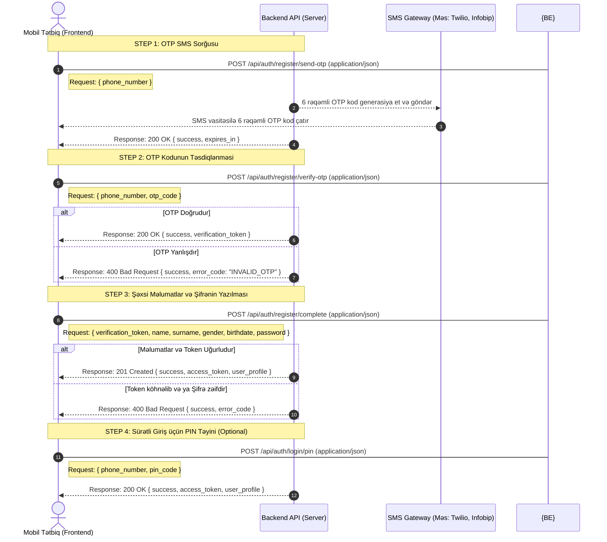

# 🚀 Loya User Registration — Backend API Flow & Requests Spec

Bu sənəd **Loya** mobil tətbiqinin müştəri tərəfi üçün qeydiyyat axışını (flow) və backend serverə göndəriləcək sorğu (Request) JSON modellərini əhatə edir.

---

## 1. 🔄 Qeydiyyat API Ardıcıllıq Diaqramı (Sequence Flow)

Backend proqramçınızın API-lər arasındakı məntiqi əlaqəni və sessiya idarəetməsini anlaması üçün ardıcıllıq diaqramı:



---

## 2. 📝 API Request JSON Modelləri & Uç Nöqtələri (Endpoints)

Bütün sorğuların (Requests) göndərilmə formatı `Content-Type: application/json` olmalıdır.

### Addım 1: OTP Sorğusu (Mobil nömrənin daxil edilməsi)
* **Endpoint:** `POST /api/auth/register/send-otp`
* **Məqsəd:** İstifadəçinin daxil etdiyi mobil nömrəyə SMS doğrulama kodu göndərmək.
* **Sorğu JSON Model:**
```json
{
  "phone_number": "+994519876543"
}
```
* **Request Parametrləri:**
  * `phone_number` *(String / Mütləqdir)*: Beynəlxalq formatda (E.164 standartı, məsələn: `+994XXXXXXXXX`) istifadəçinin mobil nömrəsi.

---

### Addım 2: OTP Doğrulanması (6 rəqəmli kodun yoxlanılması)
* **Endpoint:** `POST /api/auth/register/verify-otp`
* **Məqsəd:** İstifadəçiyə SMS ilə göndərilən 6 rəqəmli OTP kodun doğruluğunu yoxlamaq.
* **Sorğu JSON Model:**
```json
{
  "phone_number": "+994519876543",
  "otp_code": "654321"
}
```
* **Request Parametrləri:**
  * `phone_number` *(String / Mütləqdir)*: Doğrulanacaq telefon nömrəsi.
  * `otp_code` *(String / Mütləqdir)*: SMS vasitəsilə göndərilmiş 6 rəqəmli doğrulama kodu (məs: `"654321"`).

---

### Addım 3: Qeydiyyatın Tamamlanması (Profil Məlumatları & Şifrə)
* **Endpoint:** `POST /api/auth/register/complete`
* **Məqsəd:** Addım 2-dən uğurla keçmiş istifadəçinin şəxsi məlumatlarını və şifrəsini verilənlər bazasına yazaraq hesabı aktivləşdirmək.
* **Sorğu JSON Model:**
```json
{
  "verification_token": "eyJhbGciOiJIUzI1NiIsInR5cCI6IkpXVCJ9.eyJwaG9uZV9udW1iZXIiOiIrOTk0NTE5ODc2NTQzIn0...",
  "name": "Ali",
  "surname": "Aliyev",
  "gender": "male",
  "birthdate": "1998-05-18",
  "password": "Password123!"
}
```
* **Request Parametrləri:**
  * `verification_token` *(String / Mütləqdir)*: OTP doğrulaması uğurla keçdikdə Addım 2-nin Response-undan qayıdan qısamüddətli token. Backend bu tokeni yoxlayaraq istifadəçinin nömrəni təsdiqlədiyini yoxlayır.
  * `name` *(String / Mütləqdir)*: İstifadəçinin adı.
  * `surname` *(String / Mütləqdir)*: İstifadəçinin soyadı.
  * `gender` *(String / Mütləqdir)*: İstifadəçinin cinsiyyəti (Qəbul edilən dəyərlər: `male` və ya `female`).
  * `birthdate` *(String / Mütləqdir)*: Doğum tarixi, `YYYY-MM-DD` formatında (məs: `"1998-05-18"`).
  * `password` *(String / Mütləqdir)*: İstifadəçinin şifrəsi (Təhlükəsizlik qaydası: minimum 8 simvol, 1 böyük hərf, 1 kiçik hərf, 1 rəqəm və 1 xüsusi simvol).

---

### Addım 4: Sürətli Giriş üçün PIN Kod Ayarlanması
* **Endpoint:** `POST /api/auth/login/pin`
* **Məqsəd:** İstifadəçinin tətbiqə sürətli giriş edə bilməsi üçün 4 rəqəmli PIN kod təyin etməsi.
* **Sorğu JSON Model:**
```json
{
  "phone_number": "+994519876543",
  "pin_code": "0000"
}
```
* **Request Parametrləri:**
  * `phone_number` *(String / Mütləqdir)*: Sürətli giriş təyin edilən telefon nömrəsi.
  * `pin_code` *(String / Mütləqdir)*: İstifadəçinin təyin etdiyi 4 rəqəmli PIN kod (məs: `"0000"`).
