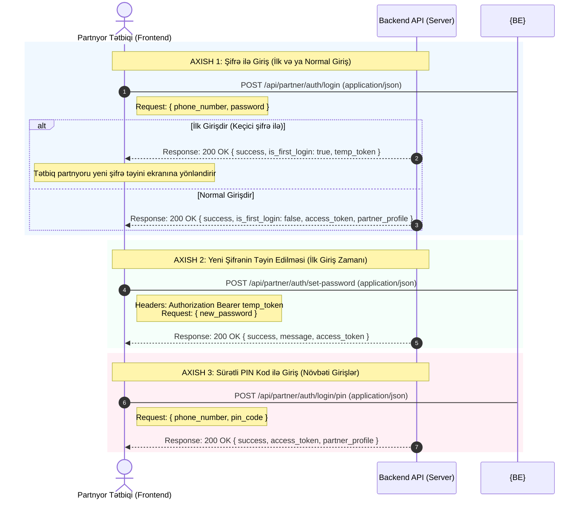

# 🤝 Loya Partner Login (Partnyor Girişi) — Backend API Spec

Bu sənəd **Loya** mobil tətbiqində **Partnyorların (Biznes/Filial sahiblərinin)** giriş (login) axışını və bu zaman backend-ə göndəriləcək **Request (Sorğu) JSON** modellərini əhatə edir.

> ⚠️ **Qeyd:** Partnyorların qeydiyyatı (register) mobil tətbiqdə yox, birbaşa **Admin Paneldə** həyata keçirilir. Partnyor ilk dəfə tətbiqə Admin Panel tərəfindən verilən keçici şifrə ilə daxil olur.

---

## 1. 🔄 Partnyor Giriş API Axış Diaqramı (Sequence Flow)



---

## 2. 📝 API Request JSON Modelləri & Uç Nöqtələri (Endpoints)

Bütün sorğuların (Requests) göndərilmə formatı `Content-Type: application/json` olmalıdır.

### 🔑 GİRİŞ (LOGIN) SORĞULARI

#### A. Şifrə ilə Giriş (İlk və ya Normal Giriş)
* **Endpoint:** `POST /api/partner/auth/login`
* **Məqsəd:** Partnyorun telefon nömrəsi və şifrəsi (Admin Panel tərəfindən verilən keçici şifrə və ya öz təyin etdiyi şifrə) ilə giriş etməsi.
* **Sorğu JSON Model:**
```json
{
  "phone_number": "+994519876543",
  "password": "Password123!"
}
```
* **Request Parametrləri:**
  * `phone_number` *(String / Mütləqdir)*: Partnyorun beynəlxalq formatda telefon nömrəsi.
  * `password` *(String / Mütləqdir)*: Giriş şifrəsi.

---

#### B. Sürətli PIN Kod ilə Giriş (PIN Login)
* **Endpoint:** `POST /api/partner/auth/login/pin`
* **Məqsəd:** Partnyorun hər dəfə şifrə yazmadan, tətbiqi sürətli açmaq üçün təyin etdiyi 4 rəqəmli PIN kod ilə giriş etməsi.
* **Sorğu JSON Model:**
```json
{
  "phone_number": "+994519876543",
  "pin_code": "1234"
}
```
* **Request Parametrləri:**
  * `phone_number` *(String / Mütləqdir)*: Partnyorun telefon nömrəsi.
  * `pin_code` *(String / Mütləqdir)*: 4 rəqəmli sürətli giriş kodu (məs: `"1234"`).

---

### 🔄 ŞİFRƏ TƏYİNİ (YALNIZ İLK GİRİŞ ZAMANI)

#### A. Yeni Şifrənin Təyin Edilməsi (First-time Set Password)
* **Endpoint:** `POST /api/partner/partner/set-password`
* **Məqsəd:** İlk dəfə keçici şifrə ilə daxil olan partnyorun özünə yeni və təhlükəsiz şifrə təyin etməsi.
* **Headers:**
  ```http
  Authorization: Bearer <temp_token>
  ```
* **Sorğu JSON Model:**
```json
{
  "new_password": "PartnerSecurePassword123!"
}
```
* **Request Parametrləri:**
  * `new_password` *(String / Mütləqdir)*: Partnyorun özü üçün təyin etdiyi yeni güclü şifrə.
