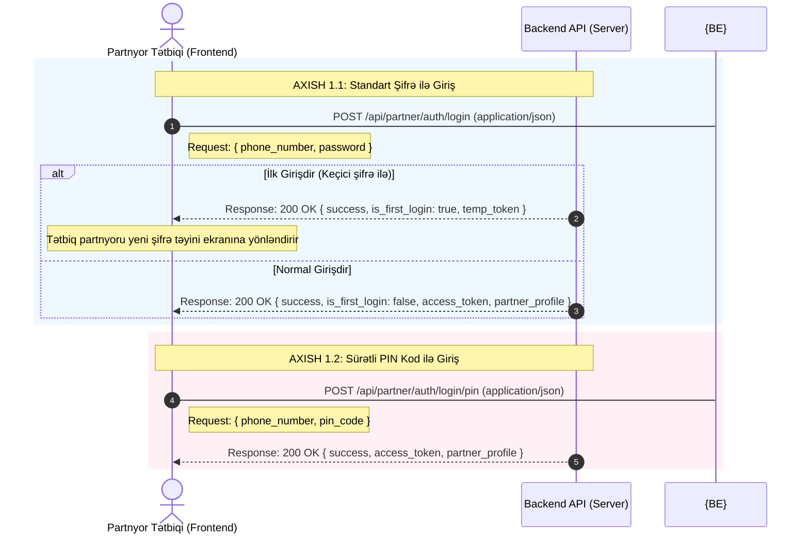
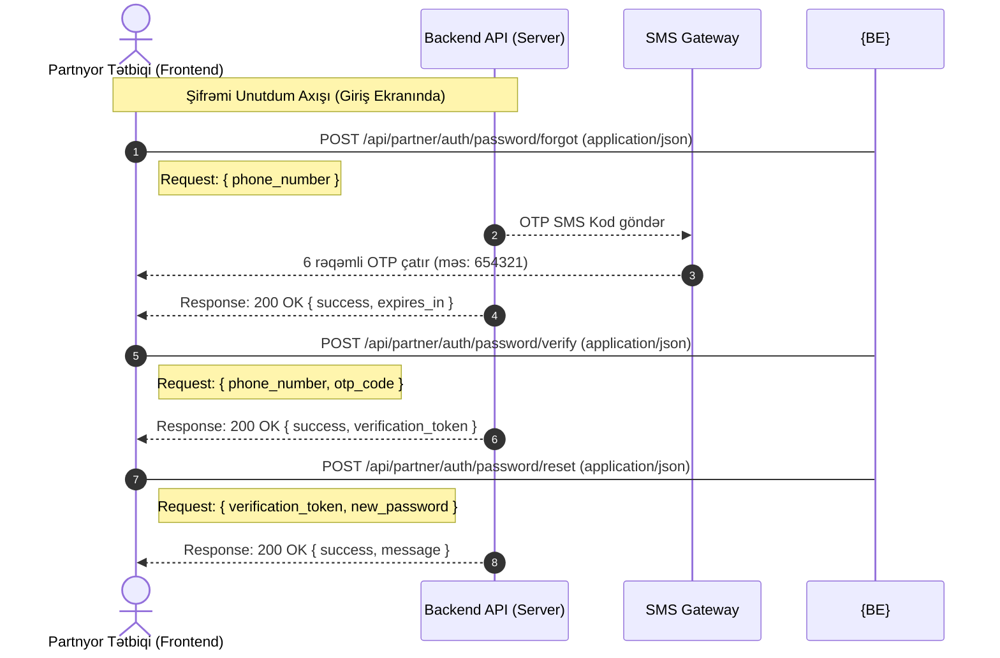
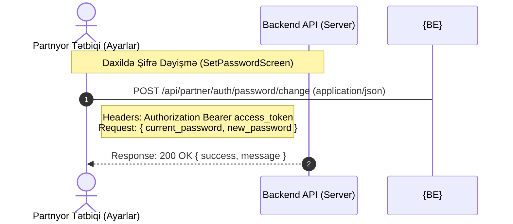

# 🤝 Loya Partner Login, Password Reset & Change — Backend API Spec

Bu sənəd **Loya** tətbiqində **Partnyorların (Biznes/Filial sahiblərinin)** Giriş (Login), Şifrə Sıfırlama (Forgot Password) və Daxildən Şifrə Dəyişmə (Change Password) axışlarını və bu zaman backend-ə göndəriləcək **Request (Sorğu) JSON** modellərini əhatə edir.

> ⚠️ **Qeyd:** Partnyorların qeydiyyatı (register) tətbiqdə yox, **Admin Paneldə** həyata keçirilir. Partnyor ilk dəfə tətbiqə Admin Panel tərəfindən verilən keçici şifrə ilə daxil olur.

---

## 1. 🔄 Partnyor Giriş & Şifrə Axışları (Sequence Flows)

### AXISH 1: Giriş və Sürətli PIN Girişi (Login & PIN Login)


### AXISH 2: Şifrəni Unutdum (Forgot Password)


### AXISH 3: Daxildən Şifrə Dəyişmə (Set / Change Password)


---

## 2. 📝 API Request JSON Modelləri & Uç Nöqtələri (Endpoints)

Bütün sorğuların (Requests) göndərilmə formatı `Content-Type: application/json` olmalıdır.

### 🔑 BÖLMƏ 1: GİRİŞ (LOGIN) SORĞULARI

#### A. Şifrə ilə Giriş (İlk və ya Normal Giriş)
* **Endpoint:** `POST /api/partner/auth/login`
* **Sorğu JSON Model:**
```json
{
  "phone_number": "+994519876543",
  "password": "Password123!"
}
```
* **Request Parametrləri:**
  * `phone_number` *(String / Mütləqdir)*: Partnyorun beynəlxalq formatda telefon nömrəsi.
  * `password` *(String / Mütləqdir)*: Giriş şifrəsi.

---

#### B. Sürətli PIN Kod ilə Giriş (PIN Login)
* **Endpoint:** `POST /api/partner/auth/login/pin`
* **Sorğu JSON Model:**
```json
{
  "phone_number": "+994519876543",
  "pin_code": "1234"
}
```
* **Request Parametrləri:**
  * `phone_number` *(String / Mütləqdir)*: Partnyorun telefon nömrəsi.
  * `pin_code` *(String / Mütləqdir)*: 4 rəqəmli sürətli giriş kodu (məs: `"1234"`).

---

### 🔄 BÖLMƏ 2: ŞİFRƏNİ UNUTDUM (FORGOT PASSWORD) SORĞULARI

#### A. Şifrə Sıfırlama OTP Sorğusu
* **Endpoint:** `POST /api/partner/auth/password/forgot`
* **Sorğu JSON Model:**
```json
{
  "phone_number": "+994519876543"
}
```

---

#### B. Şifrə Sıfırlama OTP-sinin Təsdiqlənməsi
* **Endpoint:** `POST /api/partner/auth/password/verify`
* **Sorğu JSON Model:**
```json
{
  "phone_number": "+994519876543",
  "otp_code": "654321"
}
```

---

#### C. Yeni Şifrənin Təyin Edilməsi (Reset Complete)
* **Endpoint:** `POST /api/partner/auth/password/reset`
* **Sorğu JSON Model:**
```json
{
  "verification_token": "eyJhbGciOiJIUzI1NiIsInR5cCI6IkpXVCJ9.eyJwaG9uZV9udW1iZXIiOiIrOTk0NTE5ODc2NTQzIn0...",
  "new_password": "NewSecurePassword123!"
}
```

---

### 🛠️ BÖLMƏ 3: DAXİLDƏN ŞİFRƏ DƏYİŞMƏ (CHANGE PASSWORD) SORĞUSU

#### A. Cari və Yeni Şifrə ilə Şifrə Dəyişdirilməsi
* **Endpoint:** `POST /api/partner/auth/password/change`
* **Məqsəd:** Sistemə daxil olmuş partnyorun profil tənzimləmələrindən cari şifrəsini doğrulayıb yeni şifrə təyin etməsi.
* **Headers:**
  ```http
  Authorization: Bearer <access_token>
  ```
* **Sorğu JSON Model:**
```json
{
  "current_password": "OldPassword123!",
  "new_password": "NewSecurePassword123!"
}
```
* **Request Parametrləri:**
  * `current_password` *(String / Mütləqdir)*: Partnyorun hazırkı cari şifrəsi.
  * `new_password` *(String / Mütləqdir)*: Təyin etmək istədiyi yeni təhlükəsiz şifrə.
